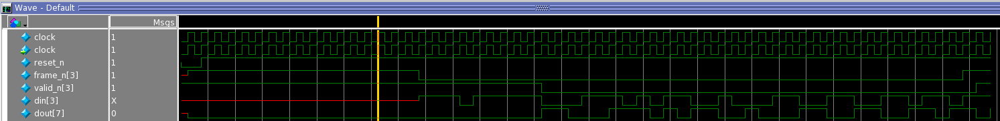
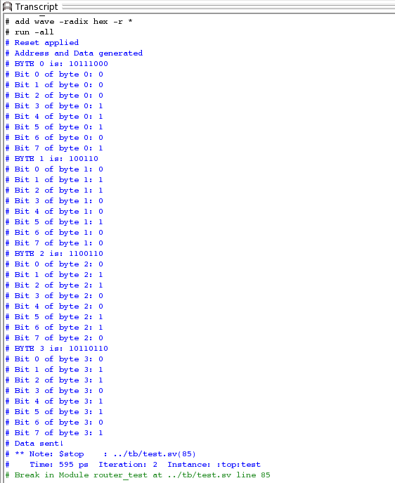

# SystemVerilog Packet Router Verification Project

This project is a SystemVerilog testbench for a Verilog-based packet router (DUT). The goal is to verify the router's ability to correctly receive packets from a source address (SA) and send them to a destination address (DA).

---

## How It Works

The verification environment is built using SystemVerilog and is structured into a Design Under Test (DUT) and a Testbench (TB).

### 1. Design Under Test (DUT)
* `rtl/router.v`: The Verilog RTL code for the packet router. It's responsible for managing packet flow from 16 input ports to 16 output ports based on a 4-bit destination address in the packet header.

### 2. Testbench (TB)
The testbench is composed of several key SystemVerilog files:

* `tb/router_test_top.sv`: This is the top-level module that connects the DUT and the testbench. It is responsible for:
    * Generating the clock signal.
    * Instantiating the DUT (`router`).
    * Instantiating the `router_io` interface.
    * Instantiating the `router_test` program.

* `tb/router_io.sv`: This `interface` file bundles all the signals (inputs and outputs) that connect the testbench to the DUT. It uses a `clocking` block to manage signal timing and a `modport` to define the testbench's (TB) directional view of the signals.

* `tb/test.sv`: This `program` block contains the core verification logic and stimulus. It is responsible for:
    * **Resetting the DUT:** The `reset()` task initializes the router.
    * **Generating Stimulus:** The `gen()` task creates a packet, setting a source address (SA=3) and destination address (DA=7) and generating a random payload.
    * **Driving the Packet:** The `send()` task (which calls `send_addrs()`, `send_pad()`, and `send_payload()`) drives the packet data into the DUT through the interface, following the router's communication protocol.

---

## Simulation Results

The following screenshots show the simulation waveform and the console transcript after running the test.

### Waveform

This waveform shows a packet being sent from input `sa=3` to output `da=7`. You can see the `frame_n[3]` and `valid_n[3]` signals initiating the packet, followed by the address and payload data. The DUT then asserts `frameo_n[7]` and `valido_n[7]` as it outputs the packet on the correct port.

### Transcript

This transcript shows the console output from the simulation, confirming the test has started and completed.

#