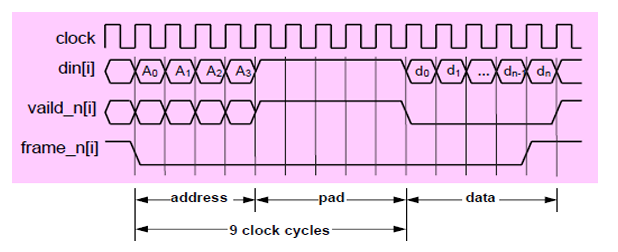

# SystemVerilog Packet Router Verification Project

This project is a SystemVerilog testbench for a Verilog-based packet router (DUT). The goal is to verify the router's ability to correctly receive packets from a source address (SA) and send them to a destination address (DA).

---

## How It Works

The verification environment is built using SystemVerilog and is structured into a Design Under Test (DUT), a Testbench (TB), and a specific communication protocol.

### 1. Design Under Test (DUT)
* `router.v`: The Verilog RTL code for the packet router. It's responsible for managing packet flow from 16 input ports to 16 output ports based on a 4-bit destination address in the packet header.

### 2. Router Input Protocol
To send a packet, the testbench must follow a specific protocol on the input pins (`din[sa]`, `valid_n[sa]`, `frame_n[sa]`) for a given source address (`sa`).

The packet transmission is a 3-stage process:

1.  **Send Destination Address:** The 4-bit destination address (`da`) is sent serially on the `din[sa]` line. During this time, both `valid_n[sa]` and `frame_n[sa]` must be held **low (0)**.
2.  **Send Padding:** Five padding bits (logic **high**) are sent on `din[sa]`. During this time, `valid_n[sa]` goes **high (1)** and `frame_n[sa]` remains **low (0)**.
3.  **Send Payload (Data):** The actual data is sent serially on `din[sa]`. During this phase:
    * `valid_n[sa]` goes back **low (0)**.
    * `frame_n[sa]` remains **low (0)** until the very last bit of the packet, at which point it goes **high (1)** to signal the end of the frame.

This reference waveform from the lab manual illustrates the protocol:

### 3. Testbench (TB)
The testbench is composed of several key SystemVerilog files that implement the protocol described above:

* `router_test_top.sv`: This is the top-level module that connects the DUT and the testbench. It is responsible for:
    * Generating the clock signal.
    * Instantiating the DUT (`router`).
    * Instantiating the `router_io` interface.
    * Instantiating the `router_test` program.

* `router_io.sv`: This `interface` file bundles all the signals (inputs and outputs) that connect the testbench to the DUT. It uses a `clocking` block to manage signal timing and a `modport` to define the testbench's (TB) directional view of the signals.

* `test.sv`: This `program` block contains the core verification logic and stimulus. It is responsible for:
    * **Resetting the DUT:** The `reset()` task initializes the router.
    * **Generating Stimulus:** The `gen()` task creates a packet, setting a source address (SA=3) and destination address (DA=7) and generating a random payload.
    * **Driving the Packet:** The `send()` task calls the sub-tasks (`send_addrs()`, `send_pad()`, and `send_payload()`) that drive the packet data into the DUT according to the router's input protocol.

---

## Simulation Results

The following screenshots show the actual simulation waveform and console transcript from running this testbench.

### Waveform

This waveform shows a packet being sent from input `sa=3` to output `da=7`. You can see the signals changing state to correctly send the address, padding, and payload, matching the protocol. The DUT then asserts `frameo_n[7]` and `valido_n[7]` as it outputs the packet on the correct port.

### Transcript

This transcript shows the console output from the simulation, confirming the test has started and completed.

